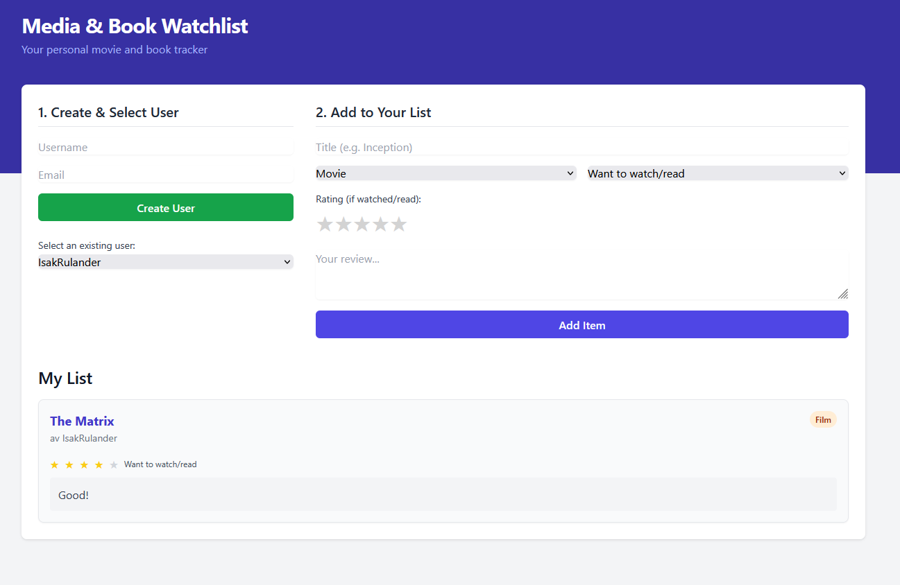
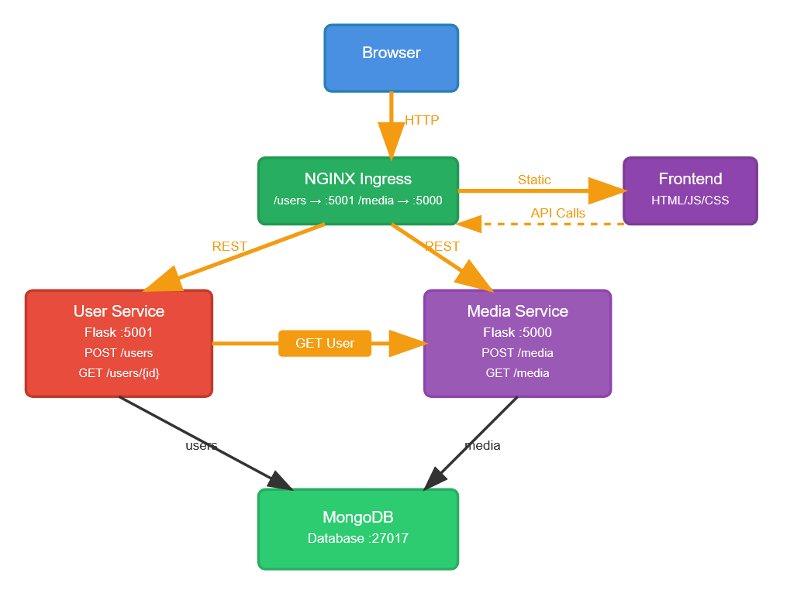

# Media & Book Watchlist

A microservices application for managing personal movie and book lists built with Python Flask, MongoDB, and Kubernetes.

## Link to git repo:
https://github.com/isakru21/Build-Something.git

## Application Screenshots

### User Interface


### System Architecture


## Quick Start

### Docker Compose (Development)
```bash
# Start application
./deploy.sh

# Stop application  
./down.sh
```
Access: `http://localhost:8080`

### Kubernetes (Production)
```bash
# Deploy to Kubernetes
./k8s-deploy.sh
```
Access: `http://localhost`

## Architecture

This application demonstrates microservices architecture with:

- **User Service** - Handles user registration and authentication
- **Media Service** - Manages movie/book watchlists and ratings
- **MongoDB** - NoSQL database for persistent storage
- **Frontend** - Responsive web interface
- **NGINX Ingress** - Load balancing and routing

## Project Structure

```
├── services/
│   ├── user-service/     # User management API (Flask)
│   └── media-service/    # Media tracking API (Flask)
├── frontend/             # Web application (HTML/CSS/JS)
├── infrastructure/
│   ├── docker-compose.yml    # Docker development setup
│   └── k8s/                  # Kubernetes production setup
└── Photos/               # Screenshots and diagrams
```

## API Endpoints

### Development (Docker Compose)
- **Users**: `http://localhost:5001/users`
- **Media**: `http://localhost:5000/media`

### Production (Kubernetes)
- **Users**: `http://localhost/users`
- **Media**: `http://localhost/media`

## Features

- Create and manage user accounts
- Add movies and books to personal watchlists
- Rate and review media items
- Microservices communicate via REST APIs
- Persistent data storage with MongoDB
- Scalable Kubernetes deployment